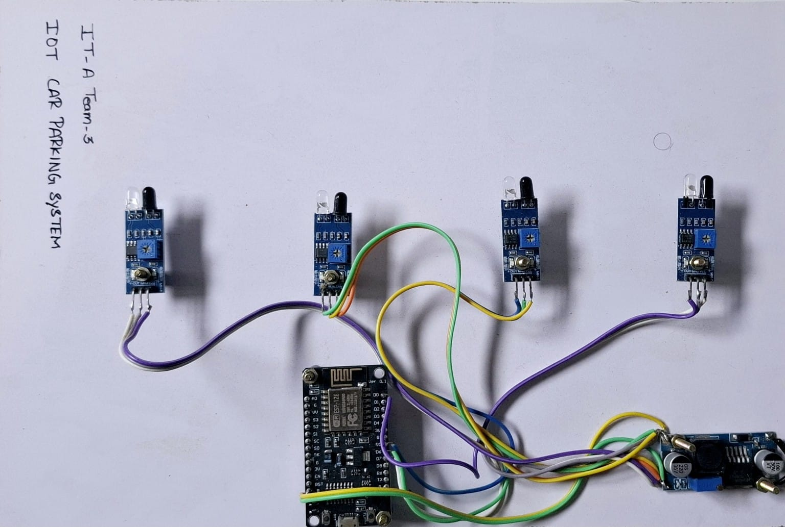

IoT Based Car Parking System

Hardware Setup

This project is a smart parking management system developed using ESP8266 NodeMCU, IR sensors, Blynk IoT platform, and Arduino IDE.

Features

- Real-time parking slot monitoring
- IR sensor based vehicle detection
- Wi-Fi enabled ESP8266 communication
- Blynk mobile app integration

Hardware Components

- ESP8266 NodeMCU
- IR Obstacle Sensors
- Jumper Wires
- Power Supply / Buck Converter

Software Used

- Arduino IDE
- ESP8266 Board Package
- Blynk IoT Platform

Project Files

- "IoT Project Report.pdf" – Mini project report
- "smart_parking.ino" – Arduino source code

Working

The IR sensors detect whether a parking slot is occupied or empty. The ESP8266 reads the sensor data and sends the parking status to the Blynk IoT platform through Wi-Fi. Users can monitor parking slot availability in real time using the Blynk mobile application.
